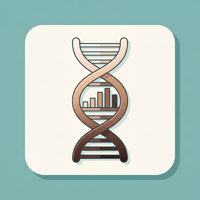
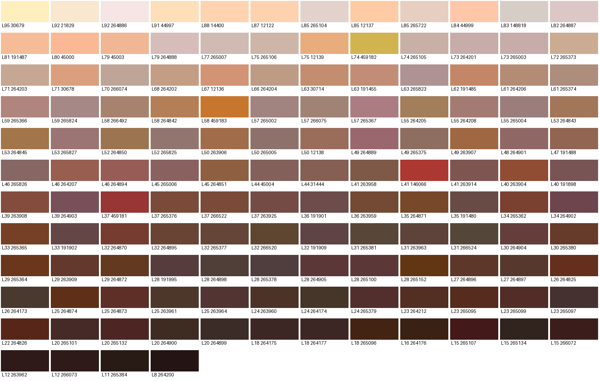
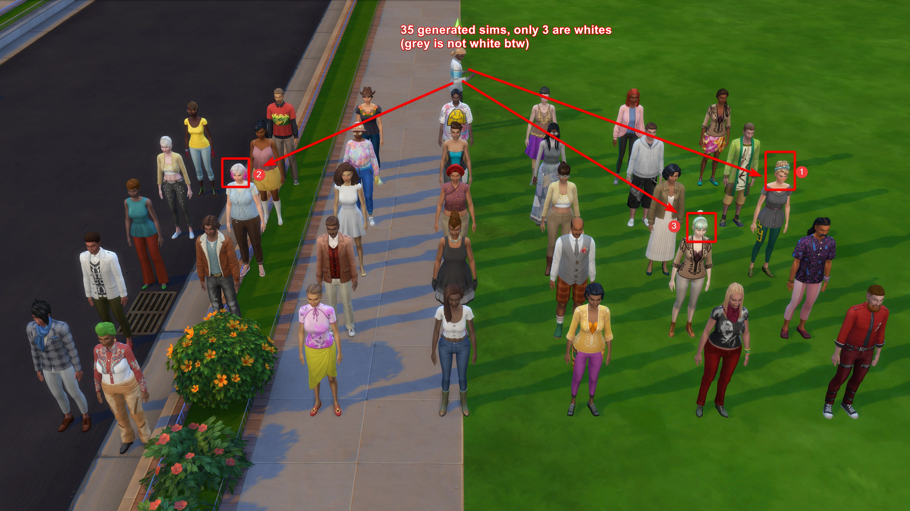
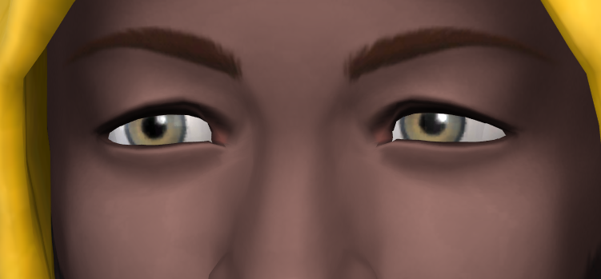
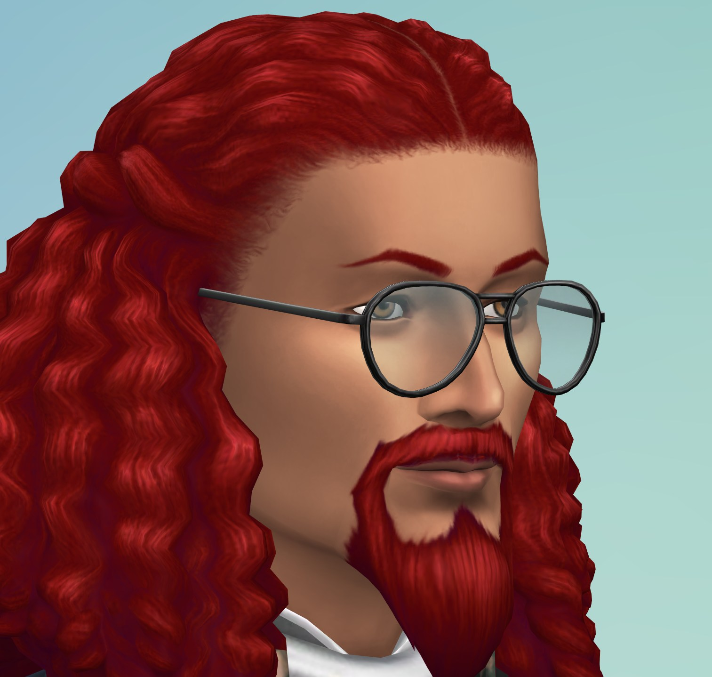
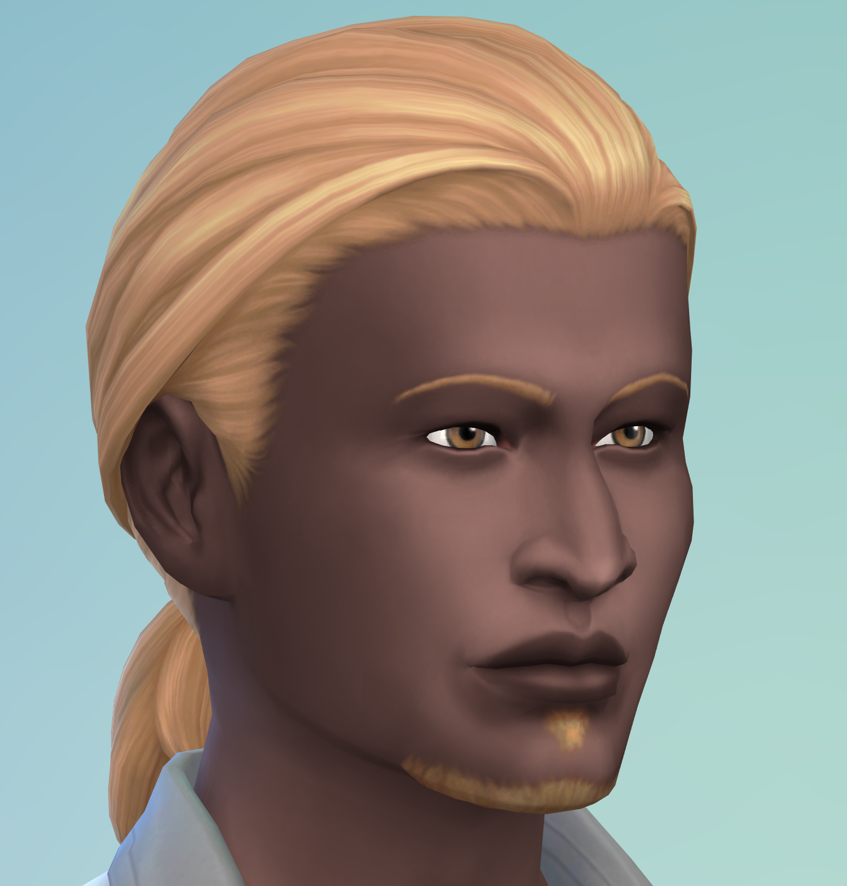
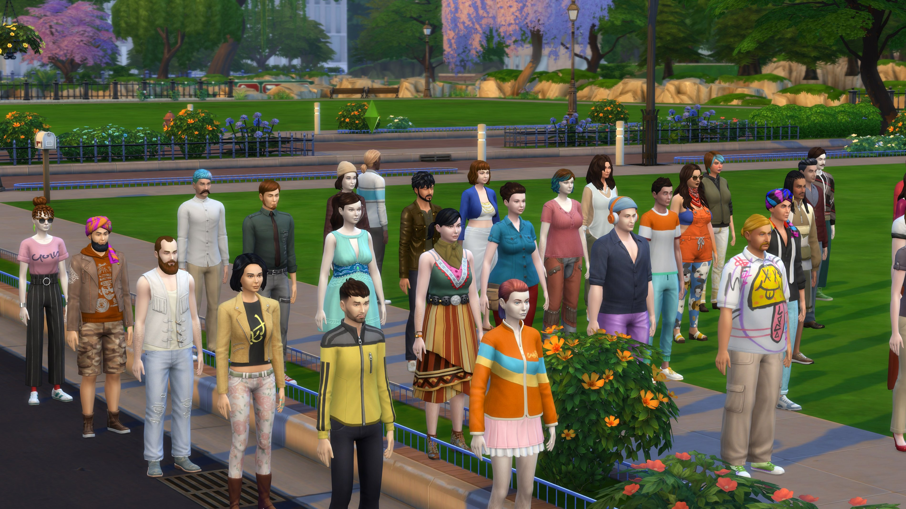

# Realistic Sim Phenotypes

A script mod for The Sims 4 that gives generated Sims (townies, NPCs, service Sims) a skin tone,
hair colour, eye colour, face shape, body shape and name that fit an origin drawn from real
population data, instead of a random pick from the Create-a-Sim palette.

> Beta, tested on game version 1.128.90. Downloads: [GitHub releases](https://github.com/ExtReMLapin/realistic-sim-phenotypes/releases).

## The problem

When the game generates a Sim, its C++ code picks the skin tone from the whole official palette,
with no notion of where the game takes place. Since the December 2020 skin tone update the palette
looks like this (136 human tones, sorted by swatch lightness):



| Swatch lightness | Tones | Share of the palette |
|---|---|---|
| White (L* >= 79) | 14 | 10% |
| Light (73-78) | 7 | 5% |
| Light brown (63-72) | 12 | 9% |
| Medium brown (45-62) | 31 | 23% |
| Dark (< 45) | 72 | 53% |

Hair and eye colour are drawn independently of the skin, and body shape follows a fixed bell
curve unrelated to any real population. Result, 35 adults generated by the unmodded game:



Because hair and eyes ignore the skin, the game regularly produces combinations that are
extremely rare in real populations, all from the unmodded generator:

| Dark skin, green eyes | Dark skin, red hair | Dark skin, blond hair |
|---|---|---|
|  |  |  |

See [docs/METHODOLOGY.md](docs/METHODOLOGY.md) for how the game generates Sims and how the
profiles were built.

## The game vs this mod

| | The game's generator | With this mod |
|---|---|---|
| Origin | None: every trait is drawn on its own | Drawn from census data for the chosen country, shared by a household |
| Skin tone | Any tone of the palette, about 1 pick in 8 is light | Lightness from population data, undertone from the tones EA tagged for the origin |
| Hair colour | Drawn without regard to skin or origin (blond and red hair on dark skin) | Measured frequencies for the origin |
| Eye colour | Drawn without regard to skin, hair or origin (green eyes on dark skin) | Linked to hair colour as in real populations (hair x eye tables) |
| Face shape | Eyes, nose and mouth presets drawn without regard to origin, although EA tagged them by origin | EA's own presets for the Sim's origin, fitting their age, gender and body frame |
| Hairstyle | Drawn without regard to origin | Afro-textured styles for African and Latin American Sims; hair form drawn per origin |
| Body shape | Narrow bell curve around "average", unrelated to any population | BMI by country, sex and age (NCD-RisC), muscle from survey data |

The game even contains a tag randomizer meant to keep the origin consistent between skin, face, hair
and eyes, but its townie generator only uses it for outfits (see the methodology).

The mod also makes sure that:

- hairstyles, beards and eyebrows suit the Sim's gender, as Create-a-Sim's gender filter does;
- beard and eyebrows have the exact shade of the hair;
- mixed Sims follow the rules of inheritance (light hair and eyes are recessive);
- children look like their parents, and babies of generated Sims inherit their look;
- elders keep grey hair in a style that fits their origin.

## What the mod does

For each generated Sim it samples, in order:

1. **Origin**, from the population profile (official census or survey figures per country).
2. **Hair colour** (red, blond, light brown, dark brown, black) from measured frequencies.
3. **Eye colour given hair colour**, from published hair x eye cross-tables, refitted to the
   country's eye colour frequencies.
4. **Skin tone**, weighted around a target lightness for the origin group (redheads only get the
   lightest tones). Among tones of similar lightness, those EA tagged for the origin are favoured,
   which gives the undertone (pale, golden).
5. **Body shape**: a BMI drawn from NCD-RisC 2024 by country, sex and age, converted to the game's
   body sliders through a published BMI-to-silhouette scale, plus a muscle axis from Eurostat
   strength-training data.
6. **Face shape**: eyes, nose and mouth taken from the game's own CAS face presets, among those EA
   tagged for the origin (EA's "archetype" tags). A European Sim no longer gets eyelids made for
   East Asian faces, and the other way round.
7. **Name**: for origins EA has a name list for (Japanese, Chinese, Indian, Moroccan, Latin,
   Islander, Southeast Asian, Native American), a first name from that list and one last name per
   household. Other Sims keep the names the game gives them, in its language.

Sims generated together (a household) share an origin, and children inherit skin, hair and eyes
from an adult of the household. Beard and eyebrows follow the hair colour. Only EA content is used
by default, so the result does not depend on your custom content.

Same spot, 35 adults with the `france` profile:



The profile also applies to dating app profiles and to Sims offered for adoption. Newborns,
clones, reincarnated Sims, relatives built from a parent's genetics and premade Sims are never
changed. Sims that already exist in a save are only changed on request, with `rsim.reroll`.

## Profiles

`europe` (population-weighted average), `france`, `uk`, `usa`, `germany`, `spain`, `italy`,
`netherlands`, `sweden`, `poland`, `japan`, `china`, `korea` (South Korea), `india`.

Every block of `data/rsim_profiles.json` carries its source and a status. The file is packed inside
`rsim.ts4script`; to edit a profile, put your own copy of `rsim_profiles.json` next to the mod:

- **[S]** sourced: taken from a study or an official statistic
- **[I]** computed or interpolated from sources
- **[D]** design choice, free to adjust

Main sources: ONS Census 2021, US Census 2020, INSEE 2023 and TeO2, Destatis Mikrozensus, CBS, SCB,
INE, ISTAT, GUS (origins); Sulem et al. 2007, Morgan et al. 2018 (UK Biobank), Ambroa-Conde et al.
2024, Mengel-From et al. 2009, Lin et al. 2016 (hair and eyes); NCD-RisC 2024 (BMI); Eurostat EHIS
2019 (strength training); Parzer et al. 2021 (BMI to silhouette); Adhikari et al. 2019 (Latin
America); Crawford et al. 2017 (Africa); for the Asian profiles, Statistics Bureau of Japan and
Immigration Services Agency, China 2020 census, Korea 2025 register-based census, Census of India
2011, KNHANES (Sung et al. 2022), Norton 2019 and Jonnalagadda et al. 2019 (skin).

Known gaps: there is no published hair or eye colour frequency table for France, Italy, Sweden or
Poland, and none at all for the Maghreb; those values are marked [D] or [I].

## Settings

`rsim.cfg`, next to the mod:

```ini
[population]
profile = europe
auto_apply = true
official_only = true
face_presets = true
names = true
```

## Console commands

| Command | Effect |
|---|---|
| `rsim.spawn [count] [age] [profile]` | Spawns test Sims around the active Sim. Age: adult, young_adult, teen, child, elder, `mix` (a random age per Sim, each in its own household) or `family` (households of two adults, a teen and a child, to check that children resemble their parents). Profile: a profile name, `default` (from the cfg), `vanilla` (untouched game generator) or `auto` (generated like a townie, through the automatic mode). |
| `rsim.profiles` | Lists the profiles |
| `rsim.freeze` | Disables autonomy on the test Sims |
| `rsim.reroll [confirm] [profile]` | Applies the profile to generated Sims already in the save. Without `confirm` it only counts them. Played households and hand-made, premade, born or adopted Sims are never touched. |
| `rsim.facepreset [count] [archetype] [eyes\|nose\|mouth\|all] [loose]` | Experimental. Spawns test adults with EA's face presets tagged for an archetype (asian, african, south_asian, middle_eastern, latin, caucasian, island, native_american, north_american; default asian eyes). By default only presets reserved to three archetypes or fewer are used; `loose` allows any preset carrying the tag. |
| `rsim.clear` | Deletes the test Sims |

## Known issue in the base game

While spawning many Sims in a row the game can freeze (simulation time stops, one thread at 100%).
This is a bug in EA's CAS part picker (`Simulation_x64.dll`): when it starts its probe at index 0 and
no catalogue entry passes the filter, the loop never ends. It happens without any mod installed.

## Building

- `python tools/build_tables.py data` regenerates `rsim_tones.json` (official skin tones and their
  lightness). Set `TS4_GAME_DIR` if needed, and point `TS4_MODS_DIR` to an empty folder so that no
  custom content ends up in the shipped table. CAS parts need no table: EA parts have 32-bit
  instance ids, while CC tools generate 64-bit ones.
- `python tools/build_parts.py data` regenerates `rsim_parts.json` (design gender of EA parts
  without gender tags, mostly eyebrows, read from their internal names).
- `python tools/build_presets.py data` regenerates `rsim_presets.json` (EA's CAS face presets with their
  archetype tags), from the game's packages only.
- `build37.py` must run under Python 3.7 (the game's version); it writes `dist/` (`rsim.ts4script`,
  with the JSON data packed inside, and `rsim.cfg`).

## License

MIT. Not affiliated with or endorsed by Electronic Arts.
